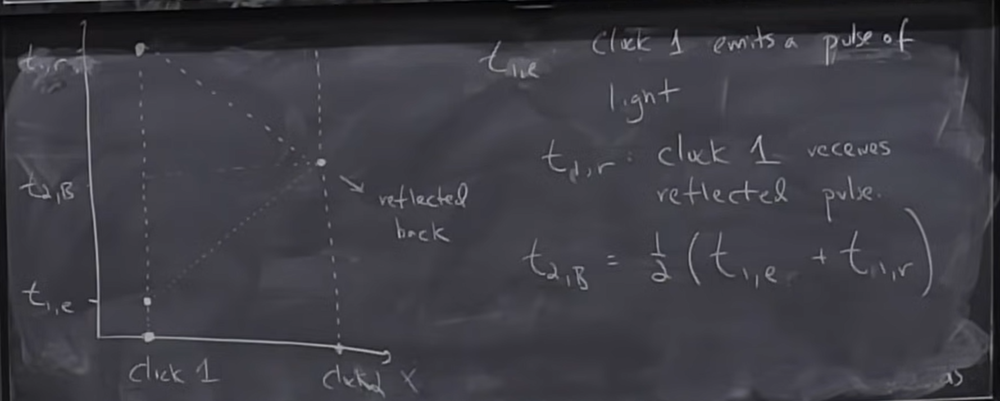

## References

Carroll - GR book
Schutz - A first course in General Relativity
Misner, Thorne, Wheeler - Gravitation (not for the fist time learners)
Wald - General Relativity (more math inclined)

No final exam lol!

## Syllabus

first half - math foundations of GR => Just before deriving the Einstein field equations
second half - Applications (theory of gravity, newton's law and beyond, black holes, etc)

---

We start the course by looking at Special Relativity in a form that emphasizes its geometric nature.

## Definitions

### Spacetime
Spacetime is a _manifold_ of _events_ that is endowed with a _metric_.

### Manifold
GPT: Manifold is a topological space that is locally Euclidean. (i.e. it looks like a Euclidean space when zoomed in)
Prof: A set of points with well-understood connectedness properties.

What we mean is that we're going to be talking about manifolds of space and time. So far it means that we have a bunch of events at some place A and some time T, and a bunch of events at some place B at time T', and the manifold is a notion of how I connect these two events.

More rigorous definition can be found in Carroll's book. (pp 54-62)

## Event
When and where something happens. (which will be labelled with coordinates, but the event itself will exist independent of these labels)

## Metric
A notion of distance between events in a manifold. \
Without this, a manifold has no notion of distance encoded in it.

[You can have a manifold without any notion of a metric attached to it. \
Joke: If you don't know what the difference is between a manifold with and without a metric, feel free to drink coffee out of a donut. \
Because they're topologically equivalent, but their geometry, which is encoded in the metric, which tells me how the different points on that manifold are arranged, are rather different.]

Later in the corse, what we're going to find is that part of Einstein's genius is that it turns out that this notion of the metric ends up encoding gravity.

---

## Special Relativity

Simplest theory of spacetime, corresponds to general relativity in the no-gravity limit.

To get into this, we need to introduce a key notion (Following Blanchford and Kip Thorne's draft, it's on the course website):

## Intertial Reference Frame
Imagine a lattice of clocks and measuring rods that allow us to label (assign coordinates) to events in spacetime. \
We require this lattice to have some properties:
1. Lattice moves freely through spacetime (i.e. it's not accelerating, no forces act on it, it doesn't rotate)
2. The measuring rods are orthogonal to each other (i.e. they define a Cartesian coordinate system)
3. The tick marks of the measuring rods are uniformly spaced (Duh, but it will be important later)
4. The clocks tick at a uniform rate (i.e. One second here is the same as one second $1km$ away)
5. The clocks are synchronized using the Einstein synchronization procedure (i.e. the speed of light is the same in all directions and to all observers, no matter which inertial reference frame they're in)

The property number $5$ is the same as the fact that if you start moving the source of light at the same direction as the emitted light, the speed of light coming out of the source is still the same as if it were stationary, but its energy is higher (i.e. it's blue-shifted).

The Einstein synchronization process:

(We can only measure the _two-way speed of light_, so we need to send a light signal from A to B and back to A, and then synchronize the clocks at A and B)

A note with regards to this course: Our basic unit of length wll be the distance light travels in our basic unit of time. (If clocks tick once every second, our length unit will be $1$ light-second) This means that in our notation, $c = \frac{1 \text{light-time-unit}}{\text{time unit}} = 1$. And this in turns means that all velocities will be dimensionless.
[Funnily enough, a light nano-second is roughly $1$ foot!]

Let $O$ be an observer in an inertial reference frame (IRF) like the one described above. \
$O$ observes two events $P, Q$. We call $\Delta x$, the displacement in spacetime from $P$ to $Q$.

We're going to define the components of this displacement vector _as seen by $O$_ in the following way:

$$
\Delta \vec{x} \, \underset{\text{O}}{\overset{\cdot}{=}} \, (t_Q - t_P, x_Q - x_P, y_Q - y_P, z_Q - z_P)
$$

When we write something like $\underset{\text{O}}{\overset{\cdot}{=}}$, it means that the geometric object written on the LHS is given according to the specified observer $O$ by the RHS.

There's also this more compact notation:

$$
\Delta \vec{x} \text{ has the components: } \Delta x^\mu \\
\mu \in \{0, 1, 2, 3\} \text{ or } \{t, x, y, z\} \\
\text{e.g. } \Delta x^0 = t_Q - t_P
$$
(The spatial coordinates could also be radial coordinates, or spherical coordinates, etc)

Generally, Greek indices in textbooks is sued to label spacetime indices. \
Latin indices are used to pick out spatial components at a particular time. \

Now, let's look at the same thing from the perspective of another observer $\bar{O}$, who is moving at a constant velocity $\vec{v}$ with respect to $O$ along axis $1$.

Note that $P, Q, \Delta \vec{x}$ are geometric objects, they exist independent of the representation we choose to use. \

So now, the components of $\Delta \vec{x}$ as seen by $\bar{O}$ are $\Delta x^{\bar{\mu}}$.

And as we are already experts (!) in Special Relativity, we know that the components $\mu$ are related to the components $\bar{\mu}$ by the Lorentz transformation:

$$
\Delta x^{\bar{0}} = \gamma (\Delta x^0 - v \Delta x^1) \\
\, \\
\Delta x^{\bar{1}} = \gamma (\Delta x^1 - v \Delta x^0) \\
\, \\
\Delta x^{\bar{2}} = \Delta x^2 \\
\, \\
\Delta x^{\bar{3}} = \Delta x^3 
$$

Where 
$$\gamma = \frac{1}{\sqrt{1 - v^2}}$$

---

Sidenote: For the Lorentz transformation, look up the quick derivation of Khan Academy:

https://www.youtube.com/watch?v=xb8nBY4MDC8

---

We can have a more compact notation for the Lorentz transformation:

$$
\Delta x^{\bar{\mu}} = \sum_{\nu=0}^{3} \Lambda^{\bar{\mu}}_{\nu} \Delta x^{\nu} \\
\, \\ 
\text{Using the Einstein summation convention:} \\
\, \\
\Delta x^{\bar{\mu}} = \Lambda^{\bar{\mu}}_{\nu} \Delta x^{\nu}
$$

Where $\Lambda^{\bar{\mu}}_{\nu}$ is the Lorentz transformation matrix. (in the first one)

Note that the $\nu$ in the above formula is the dummy index and has no meaning outside the summation. (Becomes kinda useful when we get to rename our dummy variables across equations to find patterns)

(We'll talk a bit more about the differences between the indices in the upstairs and the downstairs position later)

**Note**: We can think of the Lorentz transformation matrix as what you get when you differentiate one representation's coordinates with respect to the other representation's coordinates:

$$
\Lambda^{\bar{\mu}}_{\mu} = \frac{\partial x^{\bar{\mu}}}{\partial  x^{\mu}}
$$

## Spacetime Vector
Any quarter of numbers (components) which transforms between IRFs like a displacement vector is called a spacetime vector.
(The laws we talked about above), and it also has to obey the linearity properties of a vector.

In our notation, a scalar is something that's the same to all observers.